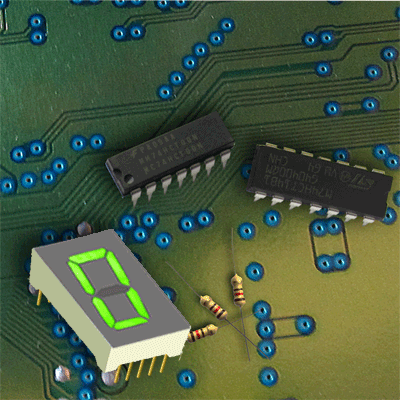

### Hi there 👋
## who am i

I am AZZEDINE LAKHDAR and I am an Embedded systems Engineering Student at INPT
 (National Institute of Posts and Telecommunication) with multiple projects done in multiple 
 embedded and electronic Domains. .

 
check my portfolio :

 <a align="right" href="https://azzedine-lakhdar.netlify.app/"> <b>Portfolio</b>  </a>
 
 

 

<!--
**Azzedine-prog/Azzedine-prog** is a ✨ _special_ ✨ repository because its `README.md` (this file) appears on your GitHub profile.

Here are some ideas to get you started:

- 🔭 I’m currently working on ...
- 🌱 I’m currently learning ...
- 👯 I’m looking to collaborate on ...
- 🤔 I’m looking for help with ...
- 💬 Ask me about ...
- 📫 How to reach me: ...
- 😄 Pronouns: ...
- ⚡ Fun fact: ...
 
  height="133"
-->
